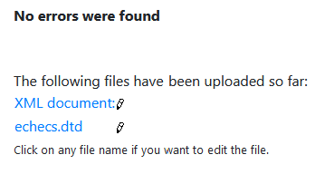

# SER - Rapport Labo 1
Auteurs:
* Da Silva Marques Fabio
* Ganguillet Anne Sophie Catherine

Date: 19.03.2021

## Introduction
Ce laboratoire a pour but de créer une DTD qui permet de modéliser la structure d'un document XML pour répondre a une certaine demande.
Dans le cadre de ce labo, la demande était de modéliser des trounois d'échecs pour une association fictive nommée "*Enjoy Chess*".

## DTD
Pour voir la dtd veuillez vous référer au fichier en annexe: `echecs.dtd`

### Explication des choix
Pour le choix de la mise en forme du contenu, on a décidé qu'on allait créer des balises pour tout ce qui concerne 
les informations de type logique informatique en tant qu'attribut et tout le reste sous forme de balises.

En ce qui concerne la validation des différentes balises et attributs on a commencé par inclure simplement les 
dépendances simples mentionnées dans la donnée. ex: Un arbitre a un nom et un prenom => `<!ELEMENT Arbitre (Nom, 
Prenom)>`

Pour les cas les plus complexes on a procédé comme ceci:
* Concernant les dépendances qui nécessitent exactement n elements (n>1) on a décidé de faire de cette façon:
    ex:

## XML
Voir fichier en annexe: `echecs.xml`

## Validation



Validation faite avec [https://www.xmlvalidation.com/index.php?id=1&L=0](https://www.xmlvalidation.com/index.php?id=1&L=0)

## Réponse aux questions

``` 
Imaginons que vous souhaitez enregistrer le classement ELO que chaque joueur d’une partie avait au moment où elle a 
été jouée, qu’est-ce qu’il faudrait modifier dans votre DTD ?
```

> Il faudrait modifier les balises JoueurBlanc et JoueurNoir de la sorte :
> ```xml
> <JoueurBlanc idJoueur="J1">
>   <!-- Ici la nouvelle balise -->
>   <ELO> 1200 </ELO>
> </JoueurBlanc>
> ```

```
Il est possible dans votre DTD de représenter le fait qu’il ne peut y avoir que 20
parties par tournoi.
- Comment faire ? Discutez également de votre solution à ce problème.
```

> Une méthode consisterait à modifier l'élément Parties en y mettant 20 fois un contenu de type Partie :
> ```dtd
> <!ELEMENT Parties (Partie,Partie?,Partie?,Partie?,...)>
> ```

```
Est-ce possible dans votre DTD d’interdire le fait qu’une équipe joue contre ellemême
dans une partie ? Justifiez votre réponse.
```

> Non parce qu'il n'est pas possible de vérifier la cohérence des données avec une DTD

```
Est-ce possible dans votre DTD de vérifier que pour une partie, l’arbitre fait bien
partie du tournoi dans lequel la partie en question est jouée ? Justifiez votre réponse
```

> La DTD ne peut pas faire cette vérification, on peut vérifier que l'arbitre existe mais on ne peut pas vérifier qu'il participe au tournois.

## Conclusion
Au therme de ce laboratoire nous avons réussi a modéliser toutes les contraintes qui nous semblaient possibles dans notre DTD. On a ainsi pu constater les limites du "langage". 

Après avoir terminé ce labo on se rend bien compte que DTD ne sert pas du tout a vérifier l'exactitude des données mais plutôt a garantir qu'une certaine structure est respectée dans le document XML. Ça permet neanmoins de faciliter une partie du travail de vérification pour les outils qui devront aller lire les données dans ces fichiers, étant donné qu'il ne reste plus qu'a vérifier l'exactitude des données.